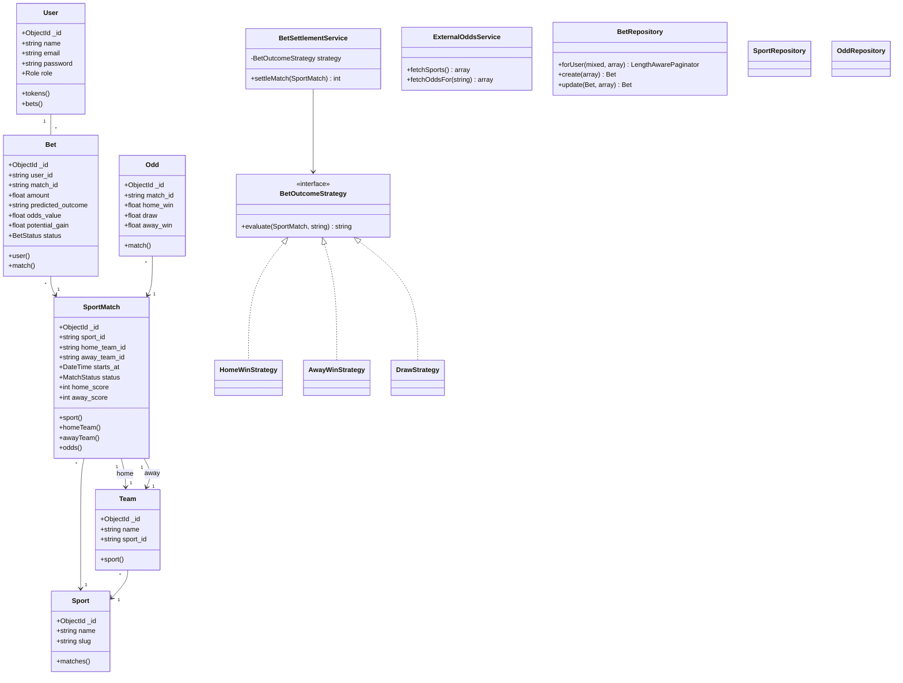

# Diagramme de classes — BetZone

## Notes

- **Persistance** : User en SQLite (Laravel Sanctum) ; Sport, Team, SportMatch,
  Odd, Bet en MongoDB. Les références inter-collections utilisent l'`_id`
  MongoDB sous forme de string.
- **Pattern Strategy** : 3 implémentations interchangeables de
  `BetOutcomeStrategy` pour résoudre l'issue d'un pari.
- **Pattern Repository** : encapsule l'accès à la persistance pour Bet, Odd,
  Sport.
- **Pattern Service** : `BetSettlementService` orchestre la résolution d'un
  match ; `ExternalOddsService` consomme une API tierce via Guzzle/HTTP.
