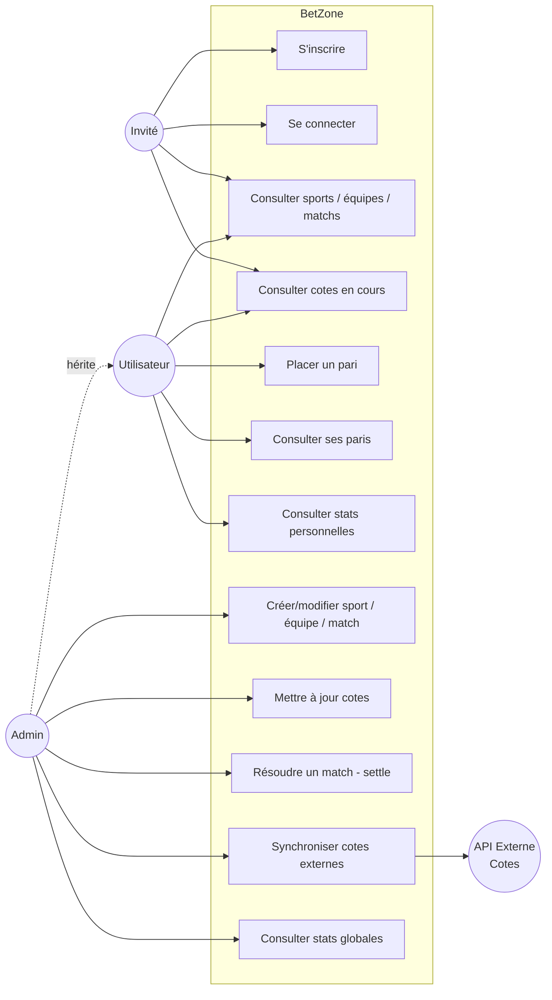

# Diagramme de cas d'utilisation — BetZone

## Acteurs

| Acteur       | Rôle                                                                   |
|--------------|------------------------------------------------------------------------|
| **Invité**   | Non authentifié, consultation publique uniquement                      |
| **Utilisateur** | Compte standard, peut parier et consulter ses statistiques          |
| **Admin**    | Tous les droits + administration des données + résolution des matchs   |
| **API externe** | Système externe fournissant cotes / résultats (sync planifié)        |

## Règles métier clés

- Un pari ne peut être placé que sur un match en statut `scheduled` (à venir).
- Une fois un match `settled`, ses paris passent en `won` ou `lost` selon la
  stratégie appliquée — plus de modification possible.
- Seul un admin peut déclencher le settlement d'un match.
