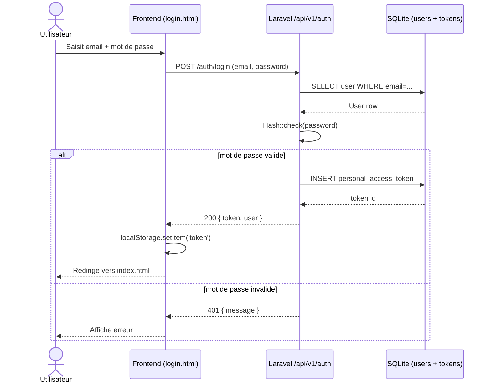
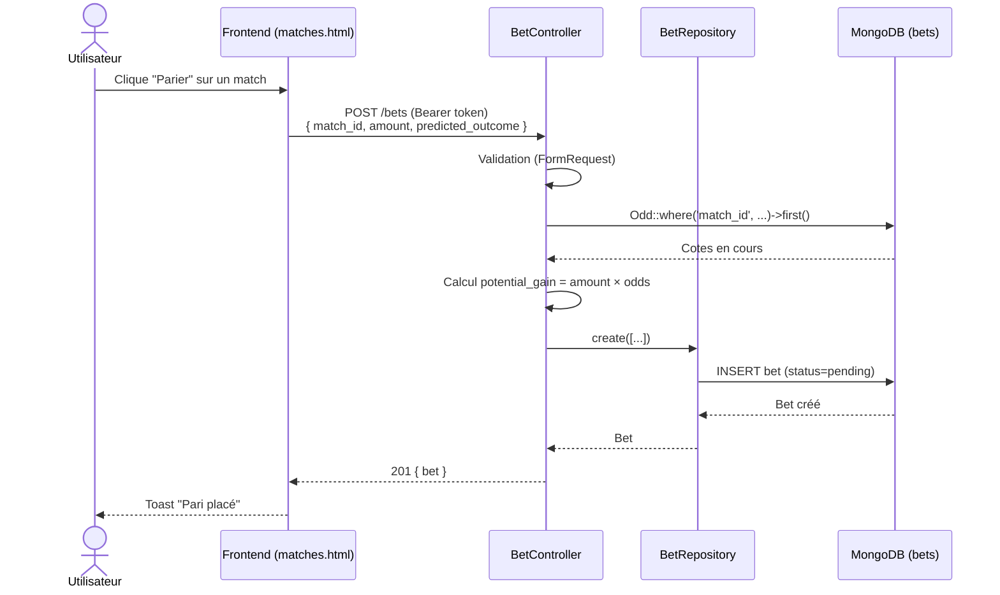
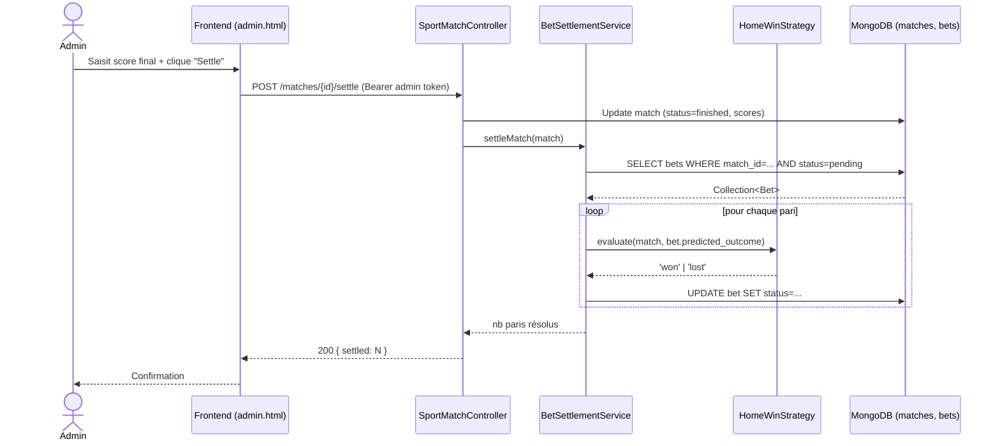

# Diagrammes de séquences — BetZone

Trois scénarios principaux illustrant les interactions client / API / MongoDB.

## Scénario 1 — Authentification (login)

## Scénario 2 — Placer un pari

## Scénario 3 — Résolution d'un match (admin)

