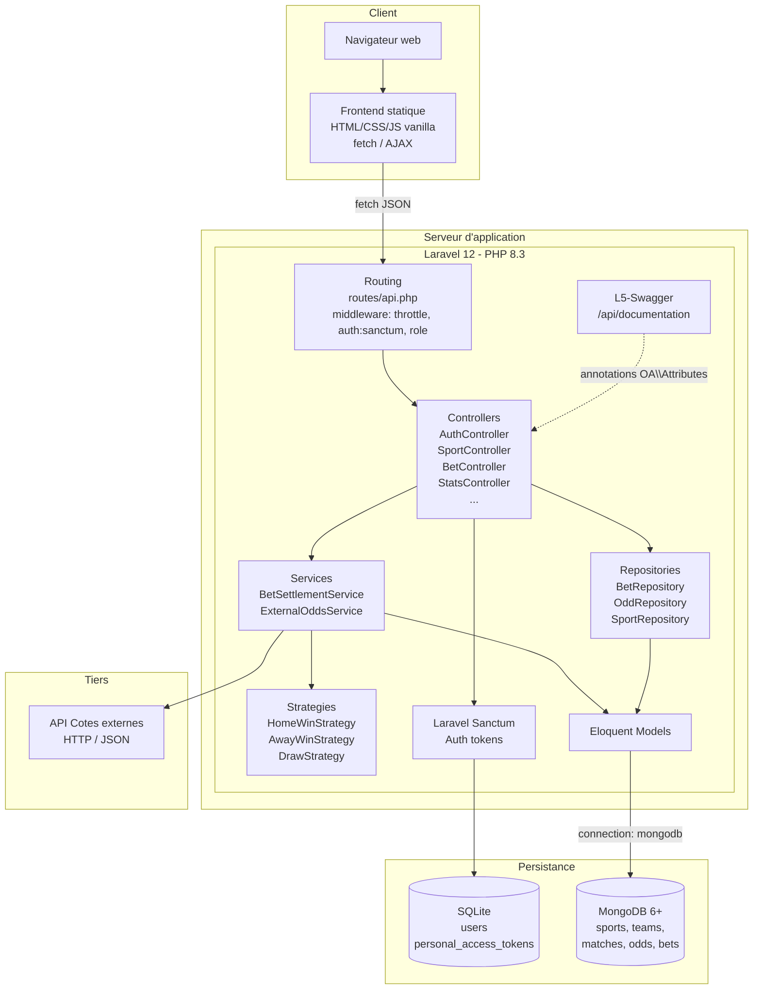

# Diagramme de composants — BetZone

Vue d'architecture haut niveau du système.

## Découpage en couches

| Couche          | Responsabilité                                                         |
|-----------------|------------------------------------------------------------------------|
| Présentation    | Frontend statique (`frontend/`), pages HTML + JS fetch                 |
| Routing / HTTP  | `routes/api.php`, FormRequests, middlewares                            |
| Application     | Controllers fins, orchestration                                        |
| Domaine         | Services, Strategies, règles métier                                    |
| Infrastructure  | Repositories, Eloquent Models, connecteur MongoDB                      |
| Données         | MongoDB (NoSQL document), SQLite (auth uniquement)                     |

## Communications externes

- **Frontend → API** : appels `fetch` JSON, token Bearer dans le header
- **API → MongoDB** : driver `mongodb/laravel-mongodb`
- **API → API externe** : `Illuminate\Support\Facades\Http` (Guzzle)
- **Auth** : tokens Sanctum stockés en SQLite, vérifiés à chaque requête
